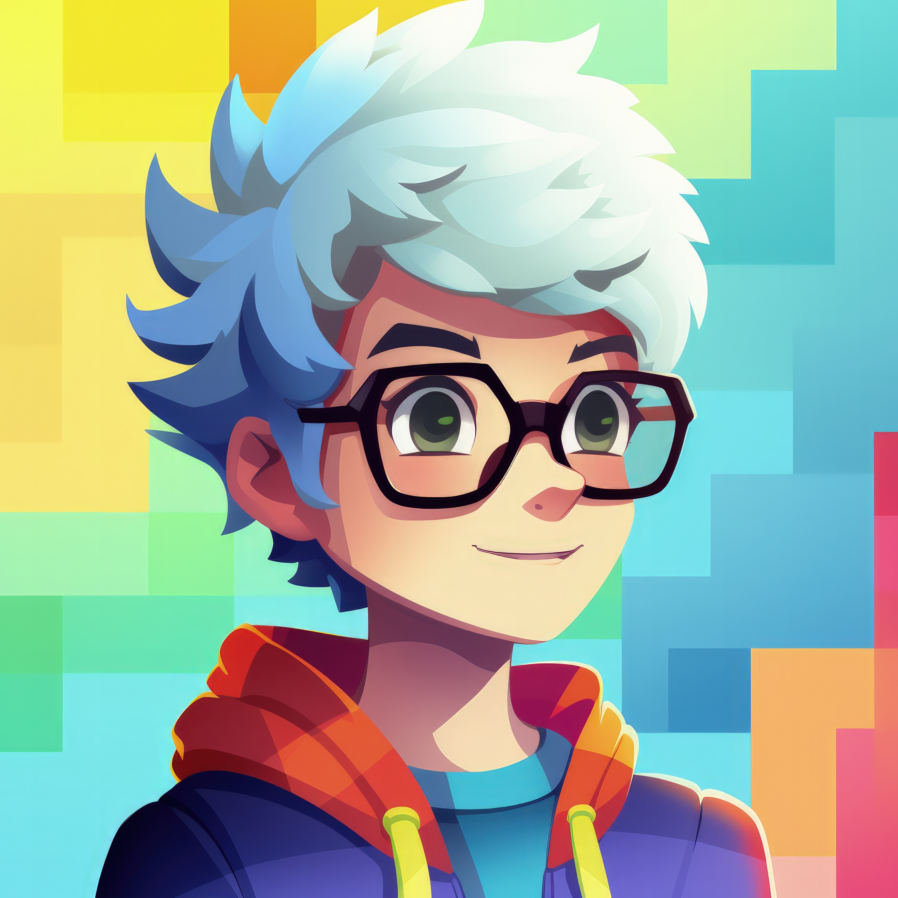

  

###

  
  
  

###

  

###

<h1 align="center">hey there 👋</h1>

###

<h3 align="left">👩‍💻  About Me</h3>

###

I'm Ayush Nashine from Indore  - 🔭 I’m Generative AI enthusiast. - 📚 I'm currently learning Gen AI. - ⚡ In my free time I love to explore about universe.

###

<h3 align="left">🛠 Language and tools</h3>

###

  
  
  
  
  
  
  
  
  
  
  
  
  
  
  
  
  
  
  
  
  

###

<h3 align="left">🔥   My Stats :</h3>

###

  

###

  
  

###
